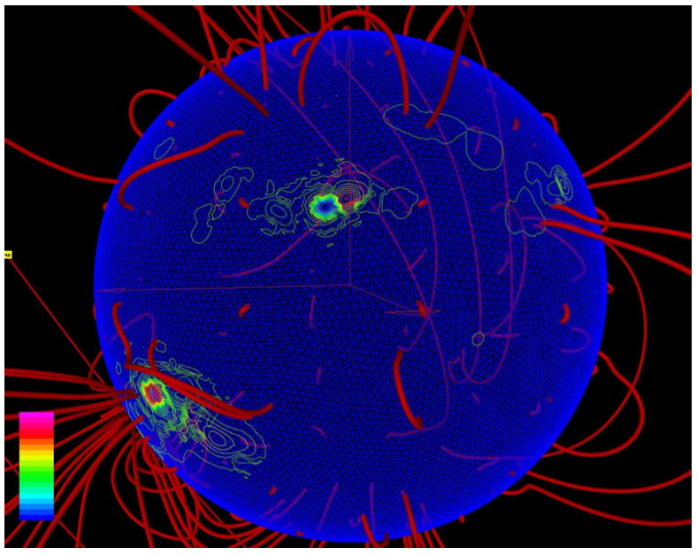

.. _Models-at-a-glance:

Model Overview
==============
Heliosphere
-----------
.. _MAS:

MAS 
...
MHD Model of Solar Corona. Model domain: 1 - 30 solar radii.

Model Authors/Developers: J. Linker, Z. Mikic, R. Lionello,
P. Riley Science Applications International Corporation
(SAIC) San Diego, California

.. _Adapt3D:

Adapt3D
.......
Adapt3D is a Solar model on an unstructured tetrahedral mesh.
Details may be found `here <http://einstein.physics.drexel.edu/~solarweather/a_mhd.html>`_.

   From Spicer et al. "A New 3D, Fully Parallel, Unstructured AMR MHD High Order Godunov Code for Modeling Sun-Earth Connection Phenomena" (preprint) 

.. _ENLIL:

ENLIL
.....
ENLIL is a time-dependent 3D MHD model of the heliosphere.
It solves for plasma mass, momentum and energy density, and
magnetic field, using a Flux-Corrected-Transport (FCT)
algorithm.

Model Authors/Developers: D. Odstrcil - University of
Boulder, Colorado

Magnetosphere
-------------
.. _BATS_R_US:

BATS-R-US
.........
BATS-R-US, the Block-Adaptive-Tree-Solarwind-Roe-
Upwind-Scheme, was developed by the Computational
Magnetohydrodynamics (MHD) Group at the University
of Michigan, now Center for Space Environment
Modeling (CSEM).

The BATS-R-US code solves 3D MHD equations in finite volume form using numerical methods related to Roe's Approximate Riemann Solver. BATSRUS uses an adaptive grid composed of rectangular blocks arranged in varying degrees of spatial refinement levels. The magnetospheric MHD part is attached to an ionospheric potential solver that provides electric potentials and conductances in the ionosphere from magnetospheric field-aligned currents.

More details can be found on the ccmc website `here <http://ccmc.gsfc.nasa.gov/models/modelinfo.php?model=BATS-R-US>`_.

.. _Open_GGCM:

Open-GGCM
.........
The UCLA/NOAA Geospace General Circulation Model (GGCM)
open_ggcm: was originally developed as a magnetohydrodynamic ( MHD )
model of Earth's magnetosphere at UCLA in the early 1990's
by J.Raeder.

.. _LFM:

LFM
...
The Lyon-Fedder-Mobarry global MHD model solves the 3D MHD equations for the Eath's magnetosphere using a stretched logically spherical grid. 

Ionosphere
----------

.. _SWMF_Ionosphere:

SWMF-Ionosphere
...............
We are in the process of folding the SWMF Ionospheric interpolator into the main development branch. In the meantime, you may access the beta version of the SWMF Ionosphere here:

ftp://hanna.ccmc.gsfc.nasa.gov/pub/GEM-CEDAR/out/high-latitude-drivers/

1) Download the following files:
	* fortran_test.tar.gz 
	* A few timesteps from SWMF_CDF/E.2001.243/ for testing
2) Unzip fortran_test 
3) cd into cdf35_0-dist and complile the CDF library (see Help.all for information on setting OS and ENV variables within the Makefile): make all
4) Follow these instructions contained in the fortran_test/README:

.. literalinclude:: Ionosphere2D_README
